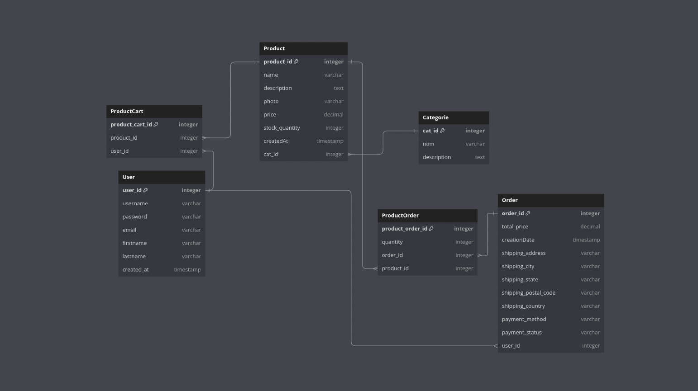

# Documentation du Projet T-WEB-600-LIL

Bienvenue dans la documentation du projet. Ce fichier README centralise les liens vers toutes les documentations relatives aux contrôleurs, entités, dépôts (repositories) et autres ressources utiles du projet.

## Technologies Utilisées
- Docker

## Auteurs
Consultez le fichier [AUTHORS.md](AUTHORS.md)

## Installation
Consultez le fichier [INSTALL.md](INSTALL.md) pour les instructions détaillées sur comment installer et configurer ce projet.

## Structure de la Documentation

La documentation est organisée en plusieurs dossiers, chacun contenant des fichiers spécifiques à un aspect du système :

### [Contrôleurs](./documentation/CONTROLLERS/README.md)

Documentation des contrôleurs utilisés dans l'application, détaillant leur fonctionnement et les routes API :

- [CategorieController](./documentation/CONTROLLERS/CategorieController.md)
- [OrderController](./documentation/CONTROLLERS/OrderController.md)
- [PaymentController](./documentation/CONTROLLERS/PaymentController.md)
- [ProductCartController](./documentation/CONTROLLERS/ProductCartController.md)
- [ProductController](./documentation/CONTROLLERS/ProductController.md)
- [ProductOrderController](./documentation/CONTROLLERS/ProductOrderController.md)
- [UserController](./documentation/CONTROLLERS/UserController.md)

### [Entités](./documentation/ENTITY/README.md)

Documentation sur les entités de la base de données :

- [Categorie](./documentation/ENTITY/Categorie.md)
- [Order](./documentation/ENTITY/Order.md)
- [Product](./documentation/ENTITY/Product.md)
- [ProductCart](./documentation/ENTITY/ProductCart.md)
- [ProductOrder](./documentation/ENTITY/ProductOrder.md)
- [ProductWishlist](./documentation/ENTITY/ProductWishlist.md)
- [User](./documentation/ENTITY/User.md)
- [ProductOrderRepository](./documentation/REPOSITORIES/ProductOrderRepository.md)
- [ProductRepository](./documentation/REPOSITORIES/ProductRepository.md)
- [UserRepository](./documentation/REPOSITORIES/UserRepository.md)

### [Dépôts (Repositories)](./documentation/REPOSITORIES/README.md)

Documentation sur les repositories qui gèrent l'accès aux données :

- [CategorieRepository](./documentation/REPOSITORIES/CategorieRepository.md)
- [OrderRepository](./documentation/REPOSITORIES/OrderRepository.md)
- [ProductCartRepository](./documentation/REPOSITORIES/ProductCartRepository.md)
- [ProductOrderRepository](./documentation/REPOSITORIES/ProductOrderRepository.md)
- [ProductRepository](./documentation/REPOSITORIES/ProductRepository.md)
- [UserRepository](./documentation/REPOSITORIES/UserRepository.md)

### Schéma de la Base de Données

Visualisez le schéma de la base de données pour comprendre la structure et les relations des données :

## Conclusion

Cette documentation est conçue pour offrir une vue d'ensemble complète et accessible du projet, permettant aux développeurs et nouveaux utilisateurs de naviguer facilement à travers les différentes composantes du système.

